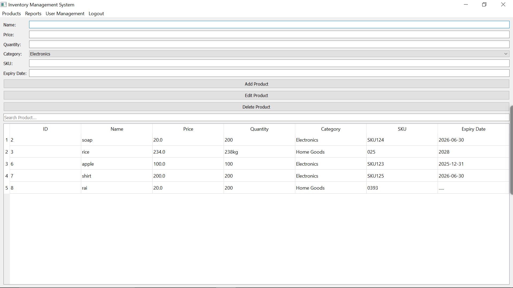

# Brainwave_Matrix_Intern_2
### 📦 **Inventory Management System**  
This project is part of my learning journey in Python development, where I am building a **fully functional Inventory Management System** using **Python (PyQt5) and SQLite**.  

---

## 🚀 **Project Overview**  
The **Inventory Management System** is designed to help businesses efficiently manage their inventory by tracking products, stock levels, sales, and user roles. The system ensures **real-time stock updates, user authentication, and reporting capabilities**.

---

## 🔥 **Features**
✅ **Product Management:** Add, Edit, Delete, and Search Products.  
✅ **Stock Tracking:** Automatically updates stock on sales.  
✅ **Low Stock Alerts:** Notifies when stock is running low.  
✅ **User Authentication:** Secure login with hashed passwords using bcrypt.  
✅ **Role-Based Access:** Supports Admin, Staff, and Viewer roles.  
✅ **Sales Management:** Track sales transactions and stock deductions.  
✅ **Reporting System:** Generate **Excel & PDF reports** for inventory.  
✅ **Dark Mode & Light Mode:** Toggle for better UI experience.  
✅ **Smooth UI Animations:** Built with PyQt5 for a modern interface.  

---

## 🛠 **Tech Stack**
- **Frontend:** Python (PyQt5)  
- **Database:** SQLite  
- **Security:** bcrypt (for password hashing)  
- **Reporting:** pandas & xlsxwriter (Excel reports), fpdf (PDF reports)  

---

## 🎮 **How It Works**
### 1️⃣ **User Authentication**
- Users **log in or sign up** using their credentials.  
- Passwords are securely stored using **bcrypt hashing**.  
- Role-based access restricts or allows different functionalities.

### 2️⃣ **Product Management**
- Users can **add, update, delete, and search** for products.  
- Products include **name, price, category, stock quantity, expiry date, and SKU**.

### 3️⃣ **Sales & Stock Management**
- Sales transactions **automatically deduct stock** from inventory.  
- Sales history is recorded and can be reviewed later.

### 4️⃣ **Reporting & Notifications**
- Users can **generate Excel and PDF reports** for inventory.  
- The system **sends alerts** when stock is low.  

### 5️⃣ **GUI Enhancements**
- Modern **PyQt5 UI** with **Dark Mode & Light Mode**.  
- Smooth animations and an **interactive dashboard** for better user experience.  

---

## 🚦 **Getting Started**
### 🏗 **Installation**
1. **Clone the repository**  
```sh
git clone <your-repository-url>
cd inventory-management
```
2. **Create a Virtual Environment & Install Dependencies**  
```sh
python -m venv .venv
.venv\Scripts\activate  # For Windows
source .venv/bin/activate  # For macOS/Linux

pip install -r requirements.txt
```
3. **Run the Application**  
```sh
python gui/main_window.py
```

---

## 📸 **Screenshots**
  
  
  

---

## 🤝 **Contributing**
- Found a bug? Open an issue!  
- Want to improve it? Submit a pull request!  
- Feedback? Always welcome! 😊  

---

## 📄 **License**
This project is licensed under the **MIT License**.  

---

**🚀 Happy Coding!** 😊
